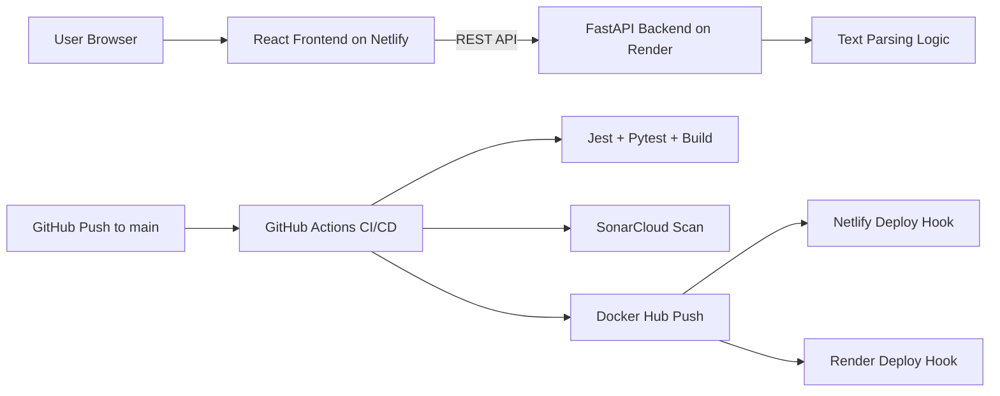

# Text Analyzer CI/CD Project

Production-style full-stack project demonstrating end-to-end CI/CD with React + FastAPI, Docker, SonarCloud, GitHub Actions, Netlify, and Render.

## 1) Repository Structure

```text
.
├── .github/workflows/ci.yml
├── backend/
│   ├── app/
│   │   ├── main.py
│   │   └── text_utils.py
│   ├── requirements.txt
│   └── tests/test_api.py
├── frontend/
│   ├── public/index.html
│   ├── src/
│   │   ├── App.js
│   │   ├── App.test.js
│   │   ├── api.js
│   │   ├── index.js
│   │   ├── setupTests.js
│   │   ├── styles.css
│   │   └── textUtils.js
│   └── package.json
├── Dockerfile.backend
├── Dockerfile.frontend
├── docker-compose.yml
└── sonar-project.properties
```

## 2) Architecture Diagram



## 3) Features

- Upload `.txt` file.
- Analyze:
  - Word count
  - Character count
  - Line count
  - Most frequent word
  - Longest word
- Search for a specific word occurrence and positions.

## 4) Local Development

### Backend

```bash
cd backend
pip install -r requirements.txt
uvicorn app.main:app --reload --port 8000
```

### Frontend

```bash
cd frontend
npm install
npm start
```

Use `REACT_APP_API_BASE_URL` to point to your backend URL.

### Docker Compose

```bash
docker compose up --build
```

- Frontend: http://localhost:3000
- Backend: http://localhost:8000

## 5) CI/CD Pipeline Explanation

The workflow `.github/workflows/ci.yml` triggers on every push to `main` and performs:

1. Frontend install + Jest tests + production build.
2. Backend dependency install + pytest + compile check.
3. SonarCloud quality scan.
4. Docker image build and push to Docker Hub.
5. Deployment trigger hooks:
   - Netlify (`NETLIFY_BUILD_HOOK`)
   - Render (`RENDER_DEPLOY_HOOK`)

## 6) GitHub Secrets Required

Add these repository secrets:

- `REACT_APP_API_BASE_URL`
- `DOCKER_USERNAME`
- `DOCKER_PASSWORD`
- `SONAR_TOKEN`
- `NETLIFY_BUILD_HOOK`
- `RENDER_DEPLOY_HOOK`

No secret is hardcoded in the repository.

## 7) Deployment Instructions

### Frontend on Netlify

1. Create a Netlify site from `frontend/`.
2. Build command: `npm run build`
3. Publish directory: `build`
4. Add env var: `REACT_APP_API_BASE_URL=<render-backend-url>`
5. Create Build Hook and store as `NETLIFY_BUILD_HOOK` in GitHub.

### Backend on Render

1. Create a Web Service from `backend/`.
2. Build command: `pip install -r requirements.txt`
3. Start command: `uvicorn app.main:app --host 0.0.0.0 --port $PORT`
4. Create Deploy Hook and store as `RENDER_DEPLOY_HOOK` in GitHub.

## 8) Live URLs

- Frontend URL: `https://<your-netlify-site>.netlify.app`
- Backend URL: `https://<your-render-service>.onrender.com`

## 9) Screenshots

Add screenshots in `docs/screenshots/` and update links below after first deployment:


